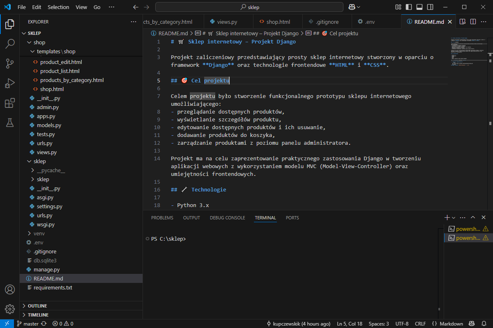

# 🛒 Sklep internetowy – Projekt Django

Projekt zaliczeniowy przedstawiający prosty sklep internetowy stworzony w oparciu o framework **Django** oraz technologie frontendowe **HTML** i **CSS**.

## 🎯 Cel projektu

Celem projektu było stworzenie funkcjonalnego prototypu sklepu internetowego umożliwiającego:
- przeglądanie dostępnych produktów,
- wyświetlanie szczegółów produktu,
- edytowanie dostępnych produktów i ich usuwanie,
- dodawanie produktów do koszyka,
- zarządzanie produktami z poziomu panelu administratora.

Projekt ma na celu zaprezentowanie praktycznego zastosowania Django w tworzeniu aplikacji webowych z wykorzystaniem modelu MVC (Model-View-Controller) oraz umiejętności frontendowych.

## 🔧 Technologie

- Python 3.x
- Django 4.x
- HTML5
- CSS3
- SQLite (domyślna baza danych Django)

## 🚀 Uruchomienie projektu lokalnie

1. **Sklonuj repozytorium:**
   ```bash
   git clone https://github.com/kupczewskik/sklep.git
   cd sklep
## UWAGA: dodałem `python-decouple` i `.env`.


